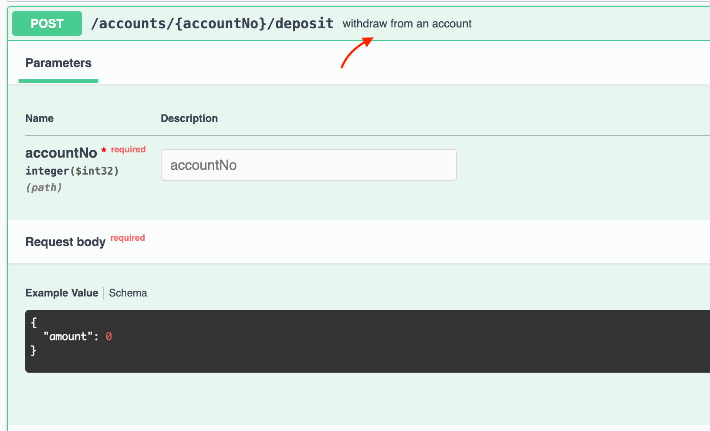
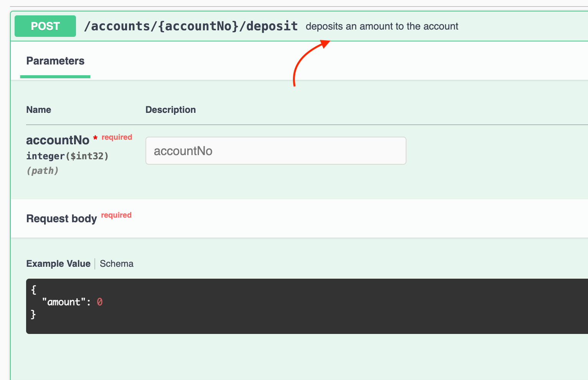

# Fun Exercise: Developing a Financial Technology Application
This project involves building a financial technology application based on a **predefined API specification**.

## Prerequisites
Before starting, ensure you have the following tools and resources
- Java: [Java 17](https://www.oracle.com/java/technologies/downloads/#java17) 
- IDE: [IntelliJ IDEA](https://www.jetbrains.com/idea/download/) (or any IDE compatible with Spring Boot applications)

## Development Guide
- **Database:** The application utilizes an H2 database, accessible at the [H2 Console](http://localhost:8080/h2-console). 
- **Schema and Data Initialization:** Schema and initial data are automatically created upon application startup. Relevant files: `schema.sql`, `data.sql` (links to files).
- **Swagger UI:** Once the application starts, you can access the Swagger UI at [http://localhost:8080/swagger-ui.html](http://localhost:8080/swagger-ui.html), which includes an example controller for reference.
- **API Specification:** Utilize the generated API spec from SwaggerHub. Configure it in the `application.yml` file under the property `springdoc.swagger-ui.url`.

## Getting Started
1. **Clone the Repository:** Use Git to clone the project repository to your local machine.
2. **Import the Project:** Import the project and make sure all dependencies are correctly resolved.
3. **Run the Application:** Ensure that all prerequisites are correctly configured.
4. **H2 Console:** Verify that the schema and data are correctly initialized [H2 Console](http://localhost:8080/h2-console).
   - `Driver Class`: `org.h2.Driver`
   - `JDBC URL`: `jdbc:h2:mem:testdb`
   - `User Name`: `sa`
   - `Password`:
   - 
   - 
5. **Looking at the `AccountController`:** You can see that the controller has the following endpoints: 
   - `GET /accounts`: Retrieves an accounts.
   - `POST /accounts/{accountNo}/deposit`: Deposits an amount to the account. 
6. **Testing an API with Swagger UI:** You can test the endpoints using the Swagger UI at [http://localhost:8080/swagger-ui.html](http://localhost:8080/swagger-ui.html).
    - `POST /accounts/{accountNo}/deposit`: deposits an amount to the account.
      - 
    - **Make a change:** Go to line: 37 `@Operation(summary = "withdraw from an account")`
      - Change the value of `summary` to `deposits an amount to the account`.
      - **Rerun the application**, and then we'll see result of that change. 
    - 🎨 Try to make any change and learn what happens.

# Instructions
Your task is to develop a financial technology application in line with the provided [API specification,](https://app.swaggerhub.com/apis/DONOTTRACKPRIVATE/fintech-bank/1.0.0)
which includes the following endpoints:
- `GET /accounts`: Retrieves an accounts. (We have already implemented this endpoint ✅)
- `POST /accounts/{accountNo}/deposit`: Deposits an amount to the account. (We have already implemented this endpoint ✅)
- `POST /accounts`: Creates an account.
- `POST /accounts/{accountNo}/withdraw`: Withdraws an amount from the account.
- `POST /accounts/{accountNo}/transfer/{targetAccountNo}`: Transfers an amount from one account to another.
- `GET /accounts/{accountNo}`: Retrieves an account.

## Challenge 1: Create `POST: /accounts` endpoint according to the [API specification](https://app.swaggerhub.com/apis/DONOTTRACKPRIVATE/fintech-bank/1.0.0#/account-controller/create)
> Suggestion: Open API specification and try to understand the request and response body. Then, implement the endpoint.

<details>
<summary>Hint: <b>Challenge 1</b></summary>

```
HTTP Method: POST
Request Mapping: /accounts

Request Body: 
{
  "type": "SAVING",
  "name": "string",
  "balance": 0 <- Double
}


Response:
{
  "no": 0, <- Integer
  "type": "SAVING",
  "name": "string",
  "balance": 0 <- Double
}
```
Using `@Operation` annotation to add description to the endpoint.
```
@Operation(summary = "จนมาเห็นกับตา จนพาใจมาเจ็บ")
```
Using `@ApiResponses` annotation to add response code and description to the endpoint.
```
@ApiResponses({
   @ApiResponse(responseCode = "200", description = "ฉีกบ่มีหม่องเย็บ หัวใจที่ให้เจ้า", { ... })
})
```
</details>

## Challenge 2: Create `POST /accounts/{accountNo}/withdraw` endpoint according to the [API specification](https://app.swaggerhub.com/apis/DONOTTRACKPRIVATE/fintech-bank/1.0.0#/account-controller/withdraw)

> Suggestion: Open API specification and try to understand the request and response body. Then, implement the endpoint.

<details>
<summary>Hint: <b>Challenge 2</b></summary>

```
HTTP Method: POST
Request Mapping: /accounts/{accountNo}/withdraw
Path Variable: accountNo (Integer)
Request Body: 
{
  "amount": 0 <- Double
}

Response
{
  "no": 0, <- Integer
  "type": "SAVING",
  "name": "string",
  "balance": 0 <- Double
}
```

Using `@Operation` annotation to add description to the endpoint.
```
@Operation(summary = "จนมาเห็นกับตา จนพาใจมาเจ็บ")
```
Using `@ApiResponses` annotation to add response code and description to the endpoint.
```
@ApiResponses({
   @ApiResponse(responseCode = "200", description = "ฉีกบ่มีหม่องเย็บ หัวใจที่ให้เจ้า", { ... })
})
```
</details>

## Challenge 3: Create `POST /accounts/{accountNo}/transfer/{targetAccountNo}` endpoint according to the [API specification](https://app.swaggerhub.com/apis/DONOTTRACKPRIVATE/fintech-bank/1.0.0#/account-controller/transfer)

> Suggestion: Open API specification and try to understand the request and response body. Then, implement the endpoint.

<details>
<summary>Hint: <b>Challenge 3</b></summary>

```
HTTP Method: POST
Request Mapping: /accounts/{accountNo}/transfer/{targetAccountNo}
Path Variable: accountNo (Integer), targetAccountNo (Integer)
Request Body: 
{
  "amount": 0, <- Double
  "remark": "string"
}

Response (My account)
{
  "no": 0,
  "type": "SAVING",
  "name": "string",
  "balance": 0 <- Double
}
```

Using `@Operation` annotation to add description to the endpoint.
```
@Operation(summary = "จนมาเห็นกับตา จนพาใจมาเจ็บ")
```
Using `@ApiResponses` annotation to add response code and description to the endpoint.
```
@ApiResponses({
   @ApiResponse(responseCode = "200", description = "ฉีกบ่มีหม่องเย็บ หัวใจที่ให้เจ้า", { ... })
})
```

</details>

## Challenge 4: Create `GET /accounts/{accountNo}` endpoint according to the [API specification](https://app.swaggerhub.com/apis/DONOTTRACKPRIVATE/fintech-bank/1.0.0#/account-controller/get)

> Suggestion: Open API specification and try to understand the request and response body. Then, implement the endpoint.

<details>
<summary>Hint: <b>Challenge 4</b></summary>

```
HTTP Method: GET
Request Mapping: /accounts/{accountNo}
Path Variable: accountNo (Integer)

Response
{
  "no": 0, <- Integer
  "type": "SAVING",
  "name": "string",
  "balance": 0 <- Double
}
```

Using `@Operation` annotation to add description to the endpoint.
```
@Operation(summary = "จนมาเห็นกับตา จนพาใจมาเจ็บ")
```
Using `@ApiResponses` annotation to add response code and description to the endpoint.
```
@ApiResponses({
   @ApiResponse(responseCode = "200", description = "ฉีกบ่มีหม่องเย็บ หัวใจที่ให้เจ้า", { ... })
})
```

</details>