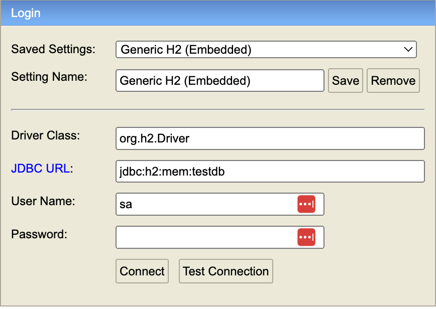
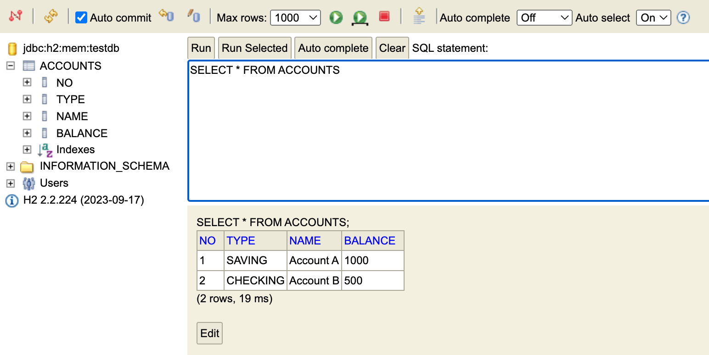
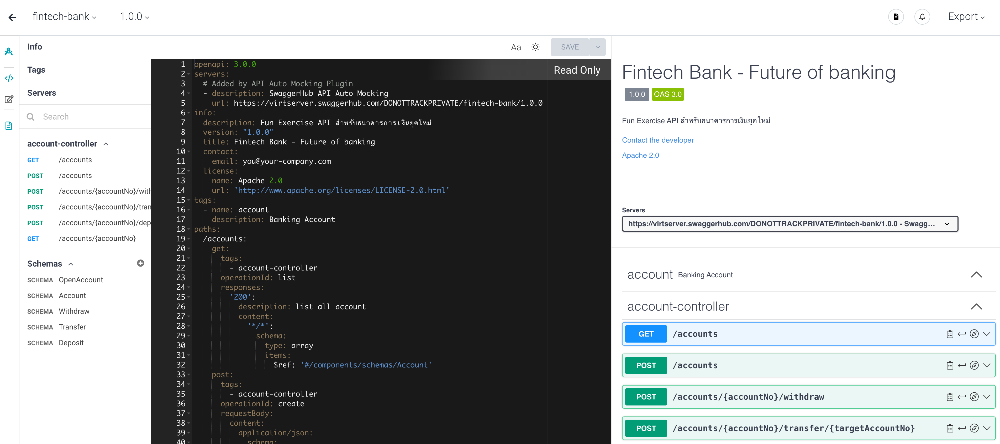

# Fun Exercise: Developing a Financial Technology Application
This project involves building a financial technology application based on a **predefined API specification**.

## Prerequisites
Before starting, ensure you have the following tools and resources
- Java: [Java 17](https://www.oracle.com/java/technologies/downloads/#java17) 
- IDE: [IntelliJ IDEA](https://www.jetbrains.com/idea/download/) (or any IDE compatible with Spring Boot applications)

## Development Guide
- **Database:** The application utilizes an H2 database, accessible at the [H2 Console](http://localhost:8080/h2-console). 
- **Schema and Data Initialization:** Schema and initial data are automatically created upon application startup. Relevant files: `schema.sql`, `data.sql` (links to files).
- **Swagger UI:** Once the application starts, you can access the Swagger UI at [http://localhost:8080/swagger-ui.html](http://localhost:8080/swagger-ui.html), which includes an example controller for reference.
- **API Specification:** Utilize the generated API spec from SwaggerHub. Configure it in the `application.yml` file under the property `springdoc.swagger-ui.url`.

## Getting Started
1. **Clone the Repository:** Use Git to clone the project repository to your local machine.
2. **Import the Project:** Import the project and make sure all dependencies are correctly resolved.
3. **Run the Application:** Ensure that all prerequisites are correctly configured.
4. **H2:** Verify that the schema and data are correctly initialized [H2 Console](http://localhost:8080/h2-console).
   - `Driver Class`: `org.h2.Driver`
   - `JDBC URL`: `jdbc:h2:mem:testdb`
   - `User Name`: `sa`
   - `Password`:

5. **Access Swagger UI:** Access the [API specification](https://app.swaggerhub.com/apis/DONOTTRACKPRIVATE/fintech-bank/1.0.0)

## Instructions
Your task is to develop a financial technology application in line with the provided [API specification,](https://app.swaggerhub.com/apis/DONOTTRACKPRIVATE/fintech-bank/1.0.0)
Follow the spec closely to ensure your application meets all requirements.